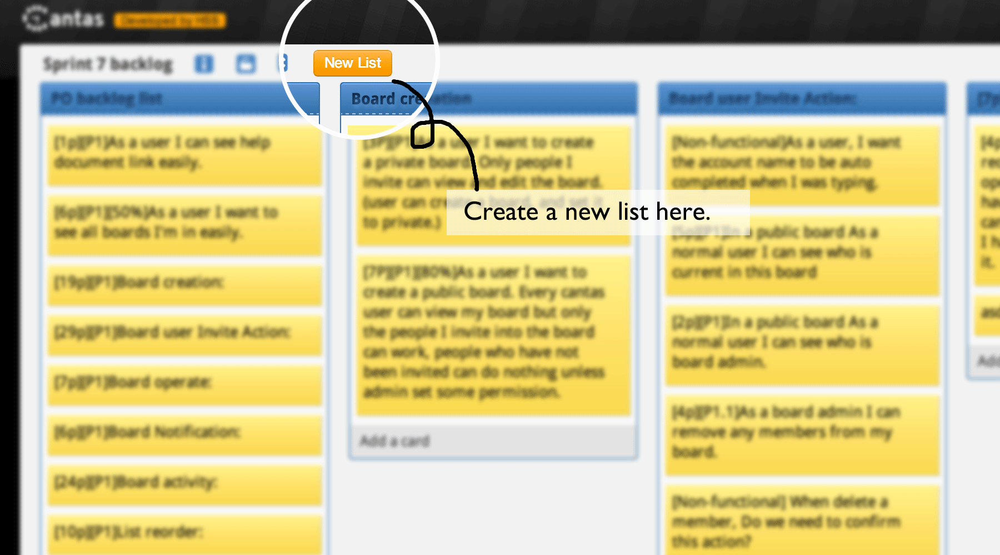

## Cantas

 About [nodejs-cantas](https://github.com/onepiecejs/nodejs-cantas)

> Cantas is a real-time collaborative web application.This is a side project,
> used as internal productivity tool in [Red Hat](https://www.redhat.com/).

> This we believe, is a great open source project for
> learning HTML5/Nodejs/socket.io/backbone.js technology.

This cantas is a Python implemention using [tornado](https://github.com/tornadoweb/tornado).

And I believe this is a great open source project for learning tornado, mongodb and websocket.

###Screenshot

  

### Demo

  http://cantas.chifruit.com

### Requirements

- [tornado](https://github.com/tornadoweb/tornado)
- [tornadio2](https://github.com/mrjoes/tornadio2)
- [backbone.js](http://backbonejs.org/)
- [socket.io](http://socket.io/)
- [MongoDB](http://www.mongodb.org/)
- [mongoengine](https://github.com/MongoEngine/mongoengine)

### Difference with nodejs-cantas

- using python as backend
- jade template was coverted to tornado template with [pyjade](https://github.com/SyrusAkbary/pyjade)
- does not suppot kerborse auth
- does not suppot impoort from Bugzilla

### TODO

* Import from trello
* The rest WebSocket events
* Permission control
* Broadcasting
    - broadcast events (e.g. board-move) to all user joined same board to make it **real-time**.